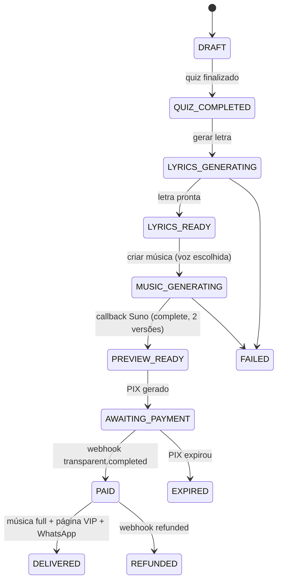

# CLAUDE.md — Orquestrador do Projeto

> **App de Músicas Personalizadas para Momentos Especiais**
> Este arquivo é a fonte de verdade para qualquer agente (Claude Code) ou dev que trabalhe no projeto. Leia por completo antes de gerar código. Em caso de conflito entre uma instrução pontual e este documento, **este documento prevalece** — se algo precisar mudar aqui, atualize o arquivo na mesma tarefa.

---

## 1. Visão Geral do Produto

App que cria **músicas personalizadas** para ocasiões emocionais (Dia dos Namorados, Dia das Mães, Dia dos Pais, aniversário de casamento, declaração de amor, etc.) a partir da história contada pelo usuário.

### Modelo de negócio (funil "pague só se gostar")

O produto é um **funil de conversão**, não um app neutro. A jornada:

1. **Conte sua história** — quiz interativo coleta ocasião, nome do homenageado, história, gênero(s) musical(is), voz.
2. **Geramos a letra** — IA escreve a letra a partir da história. Usuário revisa.
3. **Geramos 2 versões da música** (V1 e V2) via Suno. O usuário ouve **prévias limitadas** (~60-90s) de graça.
4. **Captura de WhatsApp** — antes do pagamento, capturamos o número (alavanca de conversão / recuperação).
5. **Paywall / oferta** — página de oferta com escassez (timer), pacotes e upsell. Pagamento via PIX (AbacatePay).
6. **Pós-pagamento** — desbloqueio da música completa + geração da "Página VIP" (homenagem com fotos) + entrega via WhatsApp.

> **Regra de ouro do produto:** o valor percebido (prévia emocionante) vem ANTES do pagamento. O código nunca deve gerar atrito desnecessário entre "história contada" e "prévia tocando".

### Pacotes (referência inicial — parametrizável no banco)

- **Pacote 1 — Apenas a Música:** arquivo de áudio personalizado.
- **Pacote 2 — Música + Site (Página VIP):** áudio + link de página com fotos. *(mais escolhido)*
- **Pacote 3 — Combo Master:** vídeo com fotos + música de fundo.
- **Add-ons:** nº de fotos (5 incluso / 20 fotos +R$).

Preços e descontos **não são hard-coded** — vivem na tabela `packages` / `pricing`.

---

## 2. Stack & Deploy

| Camada | Tecnologia | Observação |
|---|---|---|
| Framework | **Next.js (App Router)** full-stack | Front + back no mesmo projeto |
| Linguagem | **TypeScript strict** | `strict: true`, sem `any` |
| UI | **React + TailwindCSS** | Quiz interativo |
| Banco | **Supabase (Postgres)** | Schema gerenciado via **Supabase MCP** no Claude Code |
| Storage | **Supabase Storage** | Áudios, fotos da Página VIP |
| ORM/Acesso | Supabase JS client por trás de **Repositories** | Interface no core, impl. trocável |
| Pagamento | **AbacatePay** (Checkout Transparente PIX) | |
| Música/Letra | **Suno API** (sunoapi.org) | Async via callback |
| Mensageria | **n8n + Evolution/uazapi** | Disparado por eventos de domínio |
| Async/Filas | **Upstash QStash** ou **Inngest** | Para pipeline pós-callback |
| Deploy | **Vercel** | |

### ⚠️ Restrições do Vercel serverless (LEIA — moldam toda a arquitetura)

1. **Funções serverless não ficam abertas por minutos.** Limite de execução (configurável via `maxDuration`, máx. ~300s no plano Pro). Geração de música leva **2-3 min** → **nunca** faça polling síncrono dentro de uma request. Tudo que é demorado é **assíncrono via webhook/callback**.
2. **Não há worker de longa duração.** Processamento pesado (download de áudio, trim de prévia, upload) vai para **QStash/Inngest** ou **Supabase Edge Function**, não direto no handler do webhook.
3. **Estado entre requests vive no banco**, nunca em memória do processo.

---

## 3. Princípios de Arquitetura (não negociáveis)

Aplicação concreta dos padrões enterprise adotados:

| # | Princípio | Como aplicar aqui |
|---|---|---|
| 1 | **Clean Architecture** | `Route Handler (Controller) → Use Case → Repository/Gateway → Domain`. O `core/` é 100% agnóstico de Next/Supabase/Suno. |
| 2 | **SOLID** | 1 responsabilidade por classe. Dependências sempre via **interface**, injetadas no construtor do Use Case. |
| 3 | **Repository Pattern** | Única camada que fala com o banco. Trocar Supabase→Prisma = mexer só em `infra/repositories`. |
| 4 | **Use Case Pattern** | 1 classe por operação de negócio (`CreateOrderUseCase`, `GenerateMusicUseCase`, `UnlockSongUseCase`...). Nada de "service" com 1000 linhas. |
| 5 | **Multi-Tenant** | `tenant_id` em **toda** tabela e **toda** query. Roda single-tenant hoje (1 tenant default), mas a coluna e o filtro existem desde o dia 1. Sem fallback silencioso. *(Justificativa: agência pode white-labelar o produto.)* |
| 6 | **Unified HTTP Client** | Um client HTTP único no frontend (TanStack Query) — auth, erro e retry centralizados. |
| 7 | **Feature-based Frontend** | Cada feature = `api/ hooks/ mappers/ components/ types/`. |
| 8 | **RBAC** | Autorização centralizada por roles (`customer`, `operator`, `admin`). Evoluível para ACL granular. |
| 9 | **Gateway Pattern** | Toda integração externa (Suno, AbacatePay, WhatsApp, Storage) encapsulada em **gateway com interface**. Trocar provider = 1 arquivo. |
| 10 | **Quality Gates** | `build` + `lint` + `tsc --noEmit` como pré-requisito de merge. Bug barrado antes do deploy. |

---

## 4. Estrutura de Pastas

```
src/
├── core/                        # AGNÓSTICO de framework — coração da app
│   ├── domain/
│   │   ├── entities/            # Order, Song, Lyrics, Customer, TributePage, Payment, Package
│   │   ├── value-objects/       # WhatsAppNumber, Money(centavos), OrderStatus
│   │   └── errors/              # DomainError, OrderNotFoundError, ...
│   ├── use-cases/               # 1 classe por operação (ver §5.3)
│   │   ├── order/
│   │   ├── lyrics/
│   │   ├── music/
│   │   ├── payment/
│   │   └── tribute/
│   └── ports/                   # INTERFACES (contratos)
│       ├── repositories/        # OrderRepository, SongRepository, ...
│       └── gateways/            # MusicGateway, LyricsGateway, PaymentGateway,
│                                #   StorageGateway, NotificationGateway
│
├── infra/                       # IMPLEMENTAÇÕES (dependem de libs externas)
│   ├── repositories/            # SupabaseOrderRepository implements OrderRepository
│   ├── gateways/
│   │   ├── suno/                # SunoMusicGateway, SunoLyricsGateway
│   │   ├── abacatepay/          # AbacatePayGateway
│   │   ├── storage/             # SupabaseStorageGateway
│   │   └── notification/        # N8nWhatsAppGateway (emite evento p/ n8n)
│   ├── db/                      # cliente supabase, mappers
│   └── queue/                   # QStash/Inngest client
│
├── app/                         # Next.js App Router (camada de entrega)
│   ├── (funnel)/                # páginas do quiz/funil
│   │   ├── criar/
│   │   ├── ouvir/[orderId]/
│   │   └── oferta/[orderId]/
│   ├── vip/[slug]/              # Página de Homenagem VIP (pública)
│   └── api/
│       ├── orders/route.ts      # Controllers finos → chamam Use Cases
│       ├── webhooks/
│       │   ├── suno/route.ts     # callback Suno
│       │   └── abacatepay/route.ts
│       └── jobs/                # endpoints chamados por QStash/Inngest
│
├── features/                    # Frontend feature-based
│   └── quiz/ { api/ hooks/ mappers/ components/ types/ }
│
└── shared/                      # utils, http client, config, tipos compartilhados
```

**Regra de dependência:** `app → infra → core`. O `core` **nunca** importa de `infra` ou `app`. Use Cases recebem gateways/repositories por **interface** (injeção via construtor).

---

## 5. Modelo de Domínio

### 5.1 Entidades principais

- **Order** — a sessão do funil. Dona do estado. Tem `tenant_id`, `customer_id`, `quiz_answers`, `status`, `whatsapp`, `package_id`, `payment_id`.
- **QuizAnswers** — ocasião, momento, gêneros[], nome do homenageado, história, voz (M/F).
- **Lyrics** — letra gerada, vínculo com `order_id`, versão.
- **Song** — uma versão (V1/V2): `suno_task_id`, `suno_audio_id`, `preview_url`, `full_url` (privado), `duration`, `image_url`, `locked: boolean`.
- **Payment** — `abacatepay_id`, `amount` (centavos), `status`, `br_code`, `paid_at`.
- **TributePage** — Página VIP: `slug`, `photos[]`, `song_id`, `published`.
- **Package / Pricing** — pacotes e add-ons parametrizáveis.

> **Dinheiro sempre em centavos** (inteiro). AbacatePay opera em centavos. Nunca usar float para valores.

### 5.2 Máquina de estados do Order



**Transições só acontecem dentro de Use Cases.** Nunca mude `status` direto num repository ou controller. Toda transição valida o estado de origem (ex.: não dá pra ir de `DRAFT` para `PAID`).

### 5.3 Use Cases (1 por operação)

```
order/    CreateOrderUseCase, SaveQuizAnswersUseCase, GetOrderUseCase, CaptureWhatsAppUseCase
lyrics/   GenerateLyricsUseCase, RegenerateLyricsUseCase
music/    GenerateMusicUseCase, HandleSunoCallbackUseCase, ProcessAudioUseCase
payment/  CreatePixChargeUseCase, HandlePaymentWebhookUseCase, UnlockSongUseCase
tribute/  CreateTributePageUseCase, PublishTributePageUseCase
```

---

## 6. Fluxo do Quiz (Frontend)

Experiência tipo **quiz/chat interativo** (não formulário seco). Etapas com barra de progresso ("ETAPA X/5"):

1. **Categoria da ocasião** — botões (Amor & Casal, Família, etc.) ou texto livre.
2. **Momento exato** — dentro da categoria (Declaração de Amor, Aniversário de Namoro, Pedido de Desculpas...).
3. **Gêneros (fusão)** — multi-select (Sertanejo, Funk, Gospel, Pop, Pagode, Forró...). Permite combinar estilos.
4. **História + nome** — campo conversacional: nome do homenageado, história, detalhes.
5. **Letra → Voz → Criar** — exibe letra gerada; escolhe voz (Masculina/Feminina); botão "Criar Música".

Princípios de UX a respeitar no código:
- Cada escolha vira um "card de confirmação" ("SUA ESCOLHA: ...").
- Estado do quiz é persistido no `Order` a cada etapa (resiliente a refresh).
- Geração mostra estados de carregamento com copy emocional ("A IA está lendo sua história...").
- Player de prévia com toggle **V1 / V2** e CTA de desbloqueio.

---

## 7. Integrações Externas (Gateways)

> Cada uma é encapsulada num gateway com interface no `core/ports/gateways`. As chaves vivem em env vars (§13). **Nenhuma chave no frontend.**

### 7.1 Suno API — `MusicGateway` / `LyricsGateway`

- **Base:** `https://api.sunoapi.org/api/v1`
- **Auth:** header `Authorization: Bearer <SUNO_API_KEY>`
- **Geração de música:** `POST /generate`
  - `customMode: true`, `instrumental: false`
  - `prompt`: a **letra** (em custom mode é usada como letra cantada; limite ~5000 chars nos modelos V4_5+)
  - `style`: gênero(s) combinados
  - `title`: título da música
  - `vocalGender`: `"m"` ou `"f"` (mapear da escolha de voz)
  - `model`: `"V4_5PLUS"` ou `"V5"` (definir em config)
  - `callBackUrl`: `https://<dominio>/api/webhooks/suno`
  - **Retorna 2 músicas por request** → viram Song V1 e V2.
  - Stream URL: ~30-40s. Download URL: ~2-3 min. Limite de concorrência: 20 req / 10s.
- **Callback (3 estágios):** `text` → `first` → `complete`. Tratar `complete` como evento de prévia pronta. Payload: `code` (200=ok), `data.task_id`, `data.callbackType`, `data.data[]` com `audio_url`, `image_url`, `title`, `duration`, `tags`.
- **Fallback de polling:** `GET /generate/record-info?taskId=...` (usar se callback não chegar em X min — job agendado, não bloqueante).
- **Letra:** opção (a) endpoint de lyrics da Suno; (b) LLM próprio (OpenAI/Claude). Encapsular em `LyricsGateway` para trocar livremente. Recomendado começar com LLM próprio (mais controle do tom emocional).

### 7.2 AbacatePay — `PaymentGateway`

- **Base:** `https://api.abacatepay.com/v2`
- **Auth:** `Authorization: Bearer <ABACATEPAY_API_KEY>`. **Valores em centavos.** Envelope `{ data, success, error }`.
- **Cobrança PIX embutida (sem redirect):** `POST /transparents/create`
  - `data.amount` (centavos, obrigatório), `data.description`, `data.expiresIn` (segundos — casar com o timer da oferta), `data.customer` (`name`, `email`, `taxId`, `cellphone`), **`data.metadata`** ← guardar `orderId` aqui (chave para o webhook mapear de volta).
  - Retorna `brCode` (copia-e-cola) e `brCodeBase64` (PNG do QR) → renderizar direto na página de oferta.
- **Status:** `GET /transparents/check?id=...` (polling leve de confirmação no front, opcional).
- **Webhook:** registrar via `POST /webhooks/create` apontando para `https://<dominio>/api/webhooks/abacatepay`, evento principal **`transparent.completed`** (também tratar `transparent.refunded`). **Payload assinado via HMAC com o `secret`** → validar assinatura no handler antes de processar.
- **Testes:** `POST /transparents/simulate-payment` (devMode/sandbox).

### 7.3 Supabase Storage — `StorageGateway`

- Áudios e fotos. **Bucket privado** para áudios full; URLs assinadas (signed URLs) com expiração para acesso pós-pagamento.
- Prévias: bucket separado (ou pasta) com objeto **já trimado** (~60-90s).

### 7.4 WhatsApp via n8n — `NotificationGateway`

> **Decisão de arquitetura:** o app **não** chama a Evolution API diretamente. Ele **emite eventos de domínio** e o n8n orquestra as sequências de mensagem (aproveitando a stack existente: n8n + Evolution/uazapi).

- Padrão **Transactional Outbox**: ao mudar estado relevante, gravar evento na tabela `outbox_events` + disparar webhook para o n8n (`N8N_WEBHOOK_URL`).
- Eventos emitidos: `order.whatsapp_captured`, `order.preview_ready`, `order.payment_pending`, `order.paid`, `order.delivered`.
- O n8n decide as cadências:
  - **Pré-pagamento:** envia link da prévia + nudges de conversão; recuperação de carrinho se `AWAITING_PAYMENT` ficar parado.
  - **Pós-pagamento:** envia música completa em alta qualidade + link da Página VIP.
- **Por que assim:** desacopla a lógica de marketing/sequência (que muda muito) do core. Permite humano OU automação enviar (no n8n, basta um nó manual/aprovação). O número capturado também vira lead para remarketing.

---

## 8. Pipeline de Áudio (Prévia × Completa)

```
Suno callback (complete)
  → HandleSunoCallbackUseCase persiste task/audio_ids + status MUSIC→PREVIEW
  → enfileira job (QStash/Inngest): ProcessAudioUseCase
        1. baixa audio_url da Suno (CDN temporária)
        2. faz upload do FULL para bucket PRIVADO (Supabase)
        3. gera PRÉVIA trimada (~60-90s) com ffmpeg-static → bucket de prévias
        4. atualiza Song.preview_url / full_url / locked=true
        5. emite evento order.preview_ready
```

- **Por que re-hospedar:** as URLs da Suno são temporárias e expiram. O link entregue ao cliente precisa ser permanente → Supabase Storage.
- **Por que prévia trimada de verdade (e não só limitar o player):** limitar no client é burlável. A prévia é um **arquivo separado e curto**; o full fica em bucket privado, só acessível por signed URL após `PAID`.
- **Trim na Vercel:** `ffmpeg-static` dentro do job (com `maxDuration` elevado) OU Supabase Edge Function. Se virar gargalo, mover para worker dedicado. **Não trimar dentro do handler do webhook** (precisa responder rápido).

---

## 9. Processamento Assíncrono & Webhooks

- **Handlers de webhook respondem em <2s.** Validam assinatura, persistem o fato, enfileiram o trabalho pesado, retornam 200. O processamento acontece no job.
- **Idempotência obrigatória:** webhooks podem chegar duplicados. Toda mutação de estado checa o estado atual e é idempotente (ex.: processar `transparent.completed` duas vezes não desbloqueia/entrega duas vezes). Use `event_id` único + tabela de eventos processados.
- **Validação de assinatura:** AbacatePay (HMAC com secret). Rejeitar payload sem assinatura válida.
- **Mapa do webhook → order:** sempre via `metadata.orderId` (AbacatePay) e `task_id` (Suno) persistido no banco.
- **Retry/fallback:** se callback Suno não chegar em N min, job agendado faz polling em `/generate/record-info`.

---

## 10. Banco de Dados (Supabase via MCP)

- **⚠️ Projeto Supabase COMPARTILHADO de produção** (`ehlpmukjdknnyhkycncb`): o `public` tem centenas de tabelas de outros sistemas (inclusive `orders`/`customers`/`tenants` de OUTROS apps). **Todo o app vive no schema dedicado `cancao`** — nunca criar/alterar tabelas do app no `public`. O cliente fixa `db: { schema: 'cancao' }`. Detalhes em `supabase/README.md`.
- **Schema gerenciado pelo Supabase MCP** no Claude Code (`apply_migration`, `execute_sql`, `list_tables`). Toda mudança de schema = uma migration nomeada e versionada via MCP. **Nunca** alterar schema "na mão" pelo dashboard sem registrar a migration.
- **`tenant_id` (uuid) em todas as tabelas.** Toda query no repository filtra por `tenant_id`. Avaliar **RLS (Row Level Security)** no Supabase como segunda camada de isolamento.
- Tabelas centrais: `tenants`, `customers`, `orders`, `quiz_answers`, `lyrics`, `songs`, `payments`, `tribute_pages`, `packages`, `outbox_events`, `processed_webhooks`.
- Mappers (`infra/db/mappers`) convertem row ↔ entidade de domínio. O `core` não conhece o formato do banco.

---

## 11. Segurança

- Chaves de API (Suno, AbacatePay, Supabase service role) **só no servidor**. Nunca expor no bundle do client.
- Áudio full e fotos em buckets privados; acesso por **signed URL** com expiração, só após `PAID`.
- Validar **HMAC** dos webhooks AbacatePay; validar origem dos callbacks Suno.
- Isolamento multi-tenant sem fallback silencioso — query sem `tenant_id` é bug, não conveniência.
- Rate limit nos endpoints públicos (criação de order, geração) para evitar abuso de créditos Suno.
- LGPD: número de WhatsApp e história são dados pessoais — minimizar retenção, ter base legal/consentimento.

---

## 12. Padrões de Código & Quality Gates

- **TypeScript strict.** Proibido `any` (usar `unknown` + narrowing). Sem `// @ts-ignore` sem justificativa.
- **Lint + format:** ESLint + Prettier. Sem warning no merge.
- **Quality gate de merge:** `pnpm build && pnpm lint && pnpm typecheck` tem que passar. CI roda isso.
- **Testes:** Use Cases testados isoladamente com gateways/repos mockados (são interfaces → mock trivial). Cobertura mínima nos Use Cases de pagamento e estado.
- **Erros:** erros de domínio são classes (`DomainError`), nunca string solta. Controllers mapeiam domínio → HTTP.
- **Nomes:** Use Case = verbo+substantivo+`UseCase`. Gateway/Repository = substantivo+papel. Sem abreviação obscura.
- **Funções pequenas, responsabilidade única.** Se um arquivo passa de ~200 linhas, provavelmente tem mais de uma responsabilidade.

---

## 13. Variáveis de Ambiente

```
# Suno
SUNO_API_KEY=
SUNO_MODEL=V4_5PLUS
SUNO_CALLBACK_URL=https://<dominio>/api/webhooks/suno

# AbacatePay
ABACATEPAY_API_KEY=
ABACATEPAY_WEBHOOK_SECRET=
ABACATEPAY_WEBHOOK_URL=https://<dominio>/api/webhooks/abacatepay

# Supabase
NEXT_PUBLIC_SUPABASE_URL=
NEXT_PUBLIC_SUPABASE_ANON_KEY=
SUPABASE_SERVICE_ROLE_KEY=          # só no servidor
SUPABASE_STORAGE_BUCKET_FULL=
SUPABASE_STORAGE_BUCKET_PREVIEW=

# Fila
QSTASH_TOKEN=                       # ou Inngest keys

# WhatsApp / n8n
N8N_WEBHOOK_URL=

# App
DEFAULT_TENANT_ID=
APP_BASE_URL=
```

---

## 14. O que NUNCA fazer

- ❌ Polling síncrono de geração de música dentro de uma request (estoura o limite da Vercel).
- ❌ Trimar/processar áudio dentro do handler do webhook.
- ❌ Lógica de negócio em Route Handler ou em componente React — vai para Use Case.
- ❌ Acesso direto ao banco fora de um Repository.
- ❌ Chamar Suno/AbacatePay direto de um Use Case sem passar pela interface do Gateway.
- ❌ Query sem `tenant_id`.
- ❌ Valor monetário em float.
- ❌ Chave de API no client / no bundle.
- ❌ Mudar `Order.status` sem passar por um Use Case que valida a transição.
- ❌ Confiar em webhook único (sem idempotência e sem fallback de polling).

---

## 15. Ordem de Implementação (Roadmap)

1. **Fundação:** setup Next + TS strict + Tailwind + estrutura de pastas + cliente Supabase + migrations base (via MCP) + `tenant_id` + quality gates no CI.
2. **Domínio + Order:** entidades, máquina de estados, `CreateOrder` / `SaveQuizAnswers`, persistência.
3. **Quiz (frontend):** as 5 etapas, persistência por etapa, feature-based.
4. **Letra:** `LyricsGateway` (LLM) + `GenerateLyricsUseCase` + tela de revisão.
5. **Música:** `SunoMusicGateway` + `GenerateMusicUseCase` + webhook `/api/webhooks/suno` + `HandleSunoCallbackUseCase`.
6. **Pipeline de áudio:** job (QStash/Inngest) `ProcessAudioUseCase` (re-host + prévia trimada + signed URL).
7. **Player de prévia** (V1/V2) + captura de WhatsApp + emissão de evento.
8. **Pagamento:** `AbacatePayGateway` + `CreatePixChargeUseCase` + página de oferta (PIX embutido) + webhook `/api/webhooks/abacatepay` + `UnlockSongUseCase` (idempotente).
9. **Entrega:** `NotificationGateway` (n8n) + eventos outbox + Página VIP (`TributePage`).
10. **Upsells/pacotes:** parametrização de `packages`/add-ons, combos.

---

## 16. Como o agente (Claude Code) deve operar

- **Sempre** ler este arquivo no início de uma tarefa. Se a tarefa contraria um princípio aqui, parar e sinalizar — não burlar a arquitetura silenciosamente.
- Mudanças de schema: usar o **Supabase MCP** com migration nomeada.
- Antes de criar um endpoint, perguntar: "isso é Controller fino chamando um Use Case?" Se tem regra de negócio no handler, refatorar.
- Antes de chamar um serviço externo, perguntar: "passei por um Gateway com interface?"
- Ao adicionar feature de frontend, seguir a estrutura feature-based.
- Rodar `build + lint + typecheck` antes de considerar uma tarefa concluída.
- Manter este `CLAUDE.md` atualizado quando uma decisão arquitetural mudar.
```
